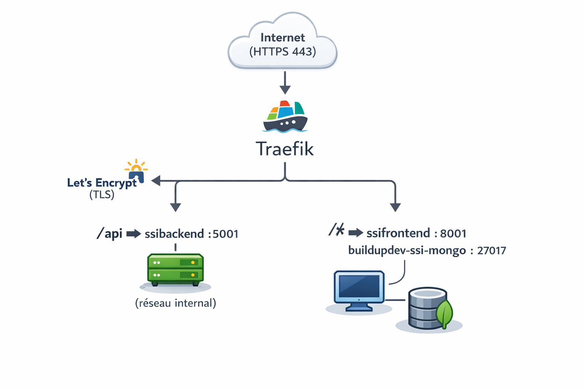
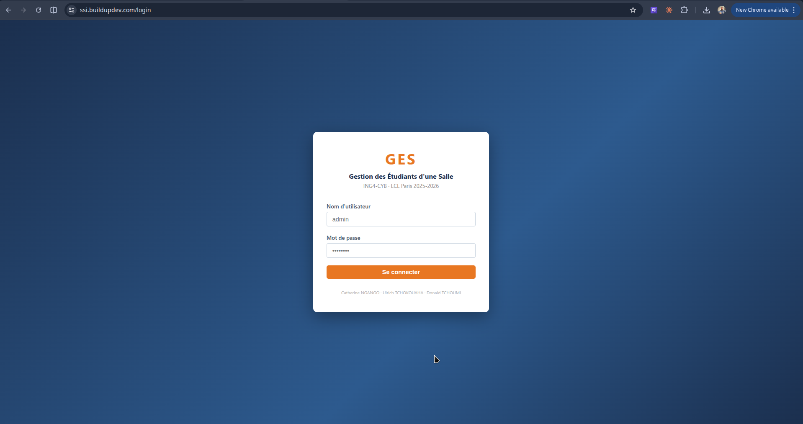
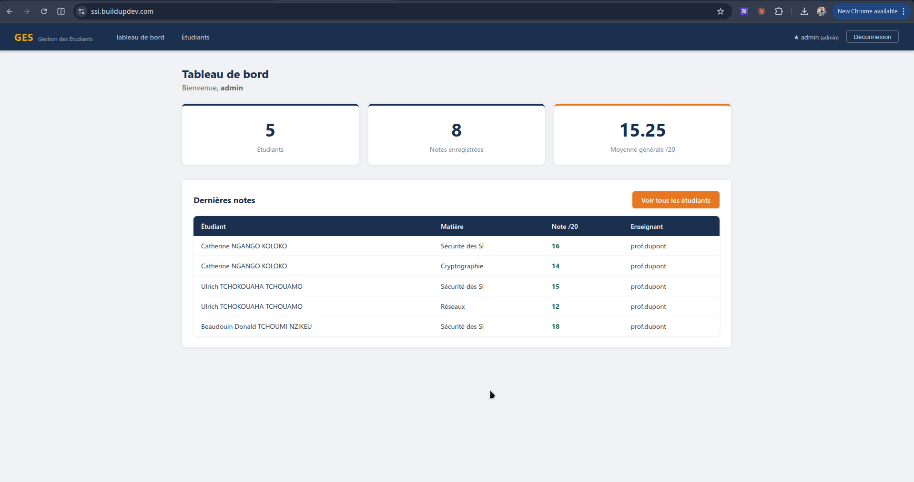
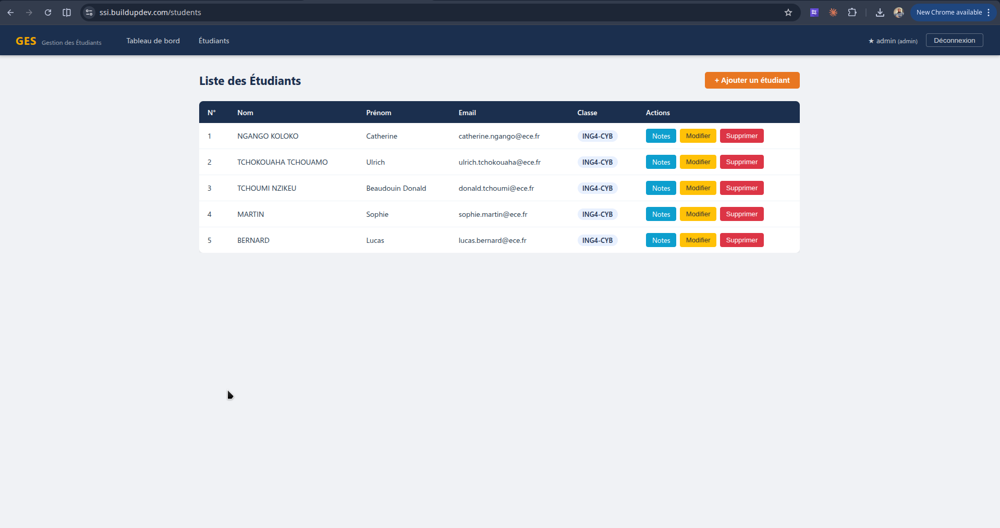
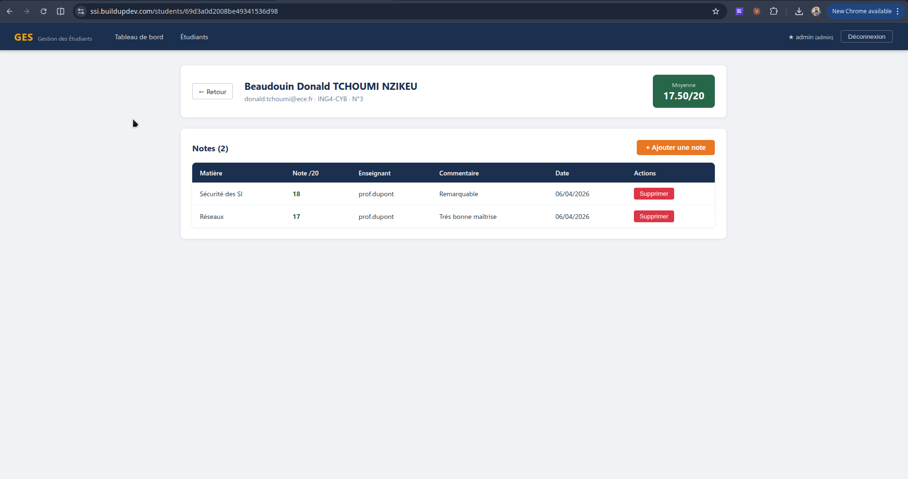
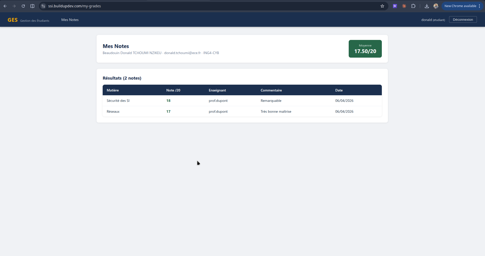

# Rapport Blue Team — Phase 1 & 2
## Application Vulnérable : GES — Gestion des Étudiants d'une Salle

---

| | |
|---|---|
| **Cours** | Sécurité des Systèmes d'Information — ECE Paris |
| **Promotion** | ING4 Cybersécurité — 2025-2026 |
| **Équipe** | Blue Team |
| **Membres** | Catherine NGANGO KOLOKO (Purple Team) · Ulrich TCHOKOUAHA TCHOUAMO (Red Team) · Beaudouin Donald TCHOUMI NZIKEU (Blue Team) |
| **Date** | Avril 2026 |
| **Version** | Phase 1 — Application vulnérable (avant correction Red Team) |

---

## Table des matières

1. [Introduction](#1-introduction)
2. [Contexte et problématique](#2-contexte-et-problématique)
3. [Architecture technique](#3-architecture-technique)
4. [Déploiement](#4-déploiement)
5. [Fonctionnalités implémentées](#5-fonctionnalités-implémentées)
6. [Stratégie de sécurité définie](#6-stratégie-de-sécurité-définie)
7. [Conclusion de la Phase 1](#7-conclusion-de-la-phase-1)

---

## 1. Introduction

Dans le cadre du projet final du cours *Sécurité des Systèmes d'Information*, notre équipe (Blue Team) a développé une application web full stack fonctionnelle simulant la **gestion des notes des étudiants d'une salle de classe**.

Conformément aux consignes du projet, l'application a été volontairement conçue avec des **failles de sécurité réalistes et exploitables**, afin de constituer un terrain d'entraînement pour la Red Team. Ce rapport documente :

- La démarche de développement et les choix techniques,
- Les fonctionnalités réalisées,
- La stratégie de sécurité prévue pour la Phase 2 (corrections post Red Team).

> Ce rapport couvre les **Phases 1 et 2** du projet : création de l'application vulnérable et définition de la stratégie de sécurité. L'identification détaillée des failles est laissée à la Red Team.

---

## 2. Contexte et problématique

### 2.1 Sujet choisi

La gestion des notes des étudiants dans une classe constitue un élément essentiel du suivi académique. Dans de nombreux établissements, ce processus reste partiellement manuel, ce qui limite l'efficacité et la fiabilité des données. Ce projet met en place une application web centralisant la gestion des notes d'une classe, avec trois profils d'utilisateurs : **administrateur**, **enseignant** et **étudiant**.

### 2.2 Problématique de sécurité

Une application de gestion de notes manipule des données personnelles et académiques sensibles. Les menaces typiques incluent :

- L'accès non autorisé aux notes d'autres étudiants,
- La modification frauduleuse de résultats,
- L'injection de contenu malveillant via des champs de saisie,
- Le contournement de l'authentification pour accéder aux données sans identifiants valides.

L'objectif pédagogique est de démontrer concrètement comment ces failles se manifestent dans une application réelle, et comment elles peuvent être exploitées et corrigées.

---

## 3. Architecture technique

### 3.1 Stack technologique

| Couche | Technologie | Version |
|---|---|---|
| Backend | Node.js + Express.js | Express 4.x |
| Base de données | MongoDB (via Mongoose) | Mongoose 8.x |
| Frontend | React + Vite | React 18 |
| Routage frontend | React Router DOM | v6 |
| Authentification | JWT (JSON Web Token) | jsonwebtoken 9.x |

### 3.2 Structure du projet

L'application suit une architecture **client-serveur découplée** :

```
ssi-student-manager/
├── backend/                   # API REST (Node.js / Express)
│   ├── index.js               # Point d'entrée, configuration CORS
│   ├── connect.js             # Connexion MongoDB
│   ├── seed.js                # Jeu de données initial
│   ├── models/
│   │   ├── User.js            # Utilisateurs (admin, enseignant, étudiant)
│   │   ├── Student.js         # Fiche étudiant
│   │   └── Grade.js           # Notes par étudiant
│   ├── controllers/
│   │   ├── authController.js
│   │   ├── studentController.js
│   │   └── gradeController.js
│   ├── routes/
│   │   ├── index.js           # Routeur principal
│   │   ├── authRoutes.js
│   │   ├── studentRoutes.js
│   │   └── gradeRoutes.js
│   └── middleware/
│       └── auth.js            # Middleware JWT verifyToken
│
└── frontend/                  # SPA React
    └── src/
        ├── App.jsx            # Routage et guards frontend
        ├── context/
        │   └── AuthContext.jsx
        ├── components/
        │   └── Navbar.jsx     # Navigation adaptée au rôle
        └── screens/
            ├── Login.jsx
            ├── Dashboard.jsx
            ├── Students.jsx
            ├── StudentDetail.jsx
            └── MyGrades.jsx   # Vue étudiant
```

### 3.3 Modèles de données

**User** — compte d'accès à l'application :
```
{ username, password, role: [admin|enseignant|etudiant], studentId? }
```

**Student** — fiche académique :
```
{ nom, prenom, email, classe, numero }
```

**Grade** — note associée à un étudiant :
```
{ studentId (ref), matiere, note (0–20), commentaire, enseignant }
```

### 3.4 Comptes de démonstration

| Nom d'utilisateur | Mot de passe | Rôle |
|---|---|---|
| `admin` | `admin123` | Administrateur |
| `prof.dupont` | `dupont2024` | Enseignant |
| `catherine` | `cath2024` | Étudiant |
| `ulrich` | `ulrich2024` | Étudiant |
| `donald` | `donald2024` | Étudiant |

---

## 4. Déploiement

### 4.1 Déploiement en ligne

L'application est déployée et accessible publiquement via HTTPS :

| | |
|---|---|
| **Frontend** | `https://ssi.buildupdev.com` |
| **API Backend** | `https://ssiapi.buildupdev.com/api` |

### 4.2 Infrastructure de déploiement

L'application tourne sur un **VPS** (`/opt/ges/app/`) avec une stack Docker orchestrée par `docker-compose`. Trois conteneurs constituent l'environnement de production :

| Conteneur | Image / Build | Rôle |
|---|---|---|
| `buildupdev-ssibackend` | `./backend/Dockerfile` | API REST Express — port interne 5001 |
| `buildupdev-ssifrontend` | `./frontend/Dockerfile` | SPA React compilée — port interne 8001 |
| `buildupdev-ssi-mongo` | `mongo:7` | Base de données MongoDB — réseau interne uniquement |

**Reverse proxy :** Traefik (stack séparée) assure le routage HTTPS et le renouvellement automatique des certificats TLS via **Let's Encrypt**. Les règles de routage sont les suivantes :

- `ssi.buildupdev.com` + préfixe `/api` → redirigé vers le backend
- `ssi.buildupdev.com` (toutes autres routes) → servi par le frontend React

**Isolation réseau :** MongoDB est accessible uniquement via le réseau Docker interne `internal` — il n'est jamais exposé à Traefik ni à l'extérieur.


> 

### 4.3 Lancement en local

Pour exécuter l'application en environnement local :

```bash
# 1. Backend
cd backend
cp .env.example .env   # configurer MONGODB_URI et JWT_SECRET
npm install
npm run seed           # peupler la base de données
npm run dev            # → http://localhost:5000

# 2. Frontend (dans un second terminal)
cd frontend
npm install
npm run dev            # → http://localhost:5173
```

 
> Page de connexion — `https://ssi.buildupdev.com/login`

---

## 5. Fonctionnalités implémentées

### 5.1 Authentification multi-rôles

L'application dispose d'un système de connexion avec trois niveaux de droits :

- **Administrateur / Enseignant** : accès au tableau de bord, à la liste complète des étudiants, aux fiches de notes individuelles, et aux opérations CRUD (création, modification, suppression).
- **Étudiant** : accès uniquement à la page *Mes Notes*, qui affiche ses propres résultats. La navigation ne comporte aucun lien vers les pages d'autres étudiants.

Après connexion, un **JWT (JSON Web Token)** est émis, stocké dans `localStorage`, et envoyé dans le header `Authorization: Bearer <token>` à chaque requête API.


> Tableau de bord (vue enseignant) — statistiques globales (nombre d'étudiants, notes enregistrées, moyenne générale)

### 5.2 Gestion des étudiants

La page `/students` (accessible aux enseignants et administrateurs) affiche la liste de tous les étudiants dans un tableau avec leurs informations (nom, prénom, email, classe, numéro). Les opérations disponibles :

- Ajouter un étudiant via un formulaire modal,
- Modifier les informations d'un étudiant,
- Supprimer un étudiant,
- Accéder à sa fiche de notes détaillée.


> Liste des étudiants avec les boutons d'action (Notes / Modifier / Supprimer)

### 5.3 Gestion des notes

La page `/students/:id` (fiche individuelle) affiche :

- L'identité de l'étudiant et sa **moyenne calculée dynamiquement**,
- Le tableau de toutes ses notes (matière, note /20, enseignant, commentaire, date),
- Un formulaire pour ajouter une nouvelle note avec un champ commentaire libre.

La moyenne est affichée en **vert** (≥ 10) ou **rouge** (< 10) selon le résultat.


> Fiche individuelle d'un étudiant avec ses notes et sa moyenne calculée

### 5.4 Interface étudiant — Mes Notes

Lorsqu'un utilisateur de rôle `etudiant` se connecte, il est automatiquement redirigé vers `/my-grades`. Cette page affiche uniquement ses propres notes. La barre de navigation ne propose que le lien *Mes Notes* — aucun bouton ne pointe vers la liste des étudiants ou vers les fiches d'autres utilisateurs.


> Vue étudiant (`/my-grades`) — page *Mes Notes* avec la navigation simplifiée (un seul lien visible)

---

## 6. Stratégie de sécurité définie

Cette section définit les mesures correctives prévues pour la **Phase 2**, après réception et analyse du rapport de pentest de la Red Team. Les corrections seront appliquées et documentées dans le second rapport Blue Team.

### 6.1 Sécurisation de l'authentification

- **Hachage des mots de passe** : remplacement des mots de passe stockés en clair par un hachage `bcrypt` avec un facteur de coût adapté.
- **Validation stricte des entrées** : forçage du typage des champs `username` et `password` en chaînes de caractères avant tout accès à la base de données, afin d'éliminer les risques liés aux opérateurs MongoDB injectés.
- **Rate limiting** : ajout d'un limiteur de requêtes (`express-rate-limit`) sur l'endpoint de login pour contrer les attaques par force brute.

### 6.2 Contrôle d'accès sur les routes API

- Application du middleware `verifyToken` sur **toutes** les routes manipulant des données sensibles, et non pas uniquement sur la zone `/api/admin`.
- Ajout d'une vérification de **propriété des ressources** : pour les utilisateurs de rôle `etudiant`, s'assurer que l'identifiant demandé correspond bien à leur propre fiche avant de retourner des données.

### 6.3 Sécurisation du rendu côté client

- Suppression de tout usage de `dangerouslySetInnerHTML` ; remplacement par du rendu texte brut natif React, qui échappe automatiquement le HTML.
- Assainissement des données en entrée côté backend avant persistance en base, afin d'empêcher le stockage de contenu malveillant.

### 6.4 Mesures transversales

| Mesure | Outil / Méthode |
|---|---|
| Headers de sécurité HTTP | `helmet.js` (`CSP`, `X-Frame-Options`, `HSTS`) |
| Validation des corps de requêtes | `joi` ou `express-validator` |
| Politique CORS restrictive | Restriction à l'origine du frontend uniquement |
| HTTPS | Certificat TLS en production |
| Protection contre la surcharge | `express-rate-limit` sur toutes les routes publiques |

---

## 7. Conclusion de la Phase 1

L'application **GES — Gestion des Étudiants d'une Salle** a été développée avec succès en suivant une architecture full stack moderne (React + Node.js + MongoDB). Elle est fonctionnelle, visuellement cohérente, et accessible en ligne à l'adresse mentionnée en section 4.

Des vulnérabilités ont été intentionnellement introduites dans l'application, couvrant les grandes catégories de l'OWASP Top 10. Chaque faille est délibérément réaliste — ce sont des erreurs de développement courantes que l'on retrouve dans des applications réelles, rendant la cible pertinente pour un exercice de pentest.

La stratégie de sécurité définie en section 6 servira de base pour la **Phase 2** (rapport de correction), qui sera produit après l'analyse du rapport de pentest de la Red Team.

---

*Beaudouin Donald TCHOUMI NZIKEU — Catherine NGANGO KOLOKO — Ulrich TCHOKOUAHA TCHOUAMO*
*ING4 Cybersécurité — ECE Paris — 2025-2026*
