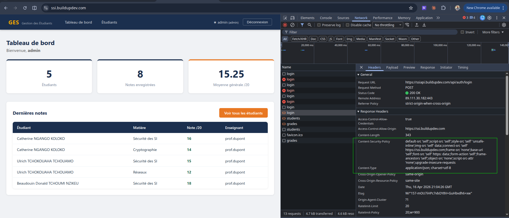
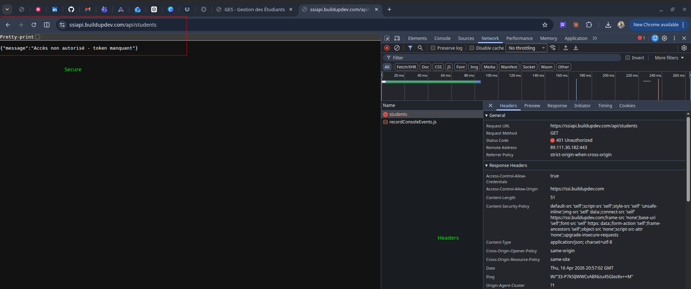
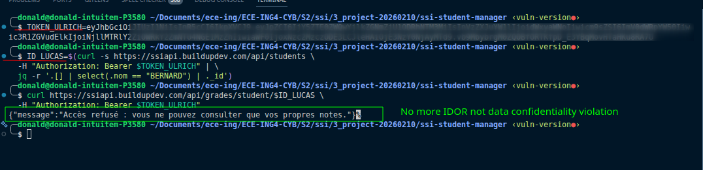

# Rapport Blue Team — Phase 4
## Réponse au Pentest et Remédiation

---

| | |
|---|---|
| **Cours** | Sécurité des Systèmes d'Information — ECE Paris |
| **Promotion** | ING4 Cybersécurité — 2025-2026 |
| **Équipe** | Blue Team |
| **Membres** | Catherine NGANGO KOLOKO (Purple Team) · Ulrich TCHOKOUAHA TCHOUAMO (Red Team) · Beaudouin Donald TCHOUMI NZIKEU (Blue Team) |
| **Date** | Avril 2026 |
| **Version** | Phase 4 — Correction des vulnérabilités après rapport Red Team |
| **Application** | `https://ssi.buildupdev.com` |

---

## Table des matières

1. [Introduction](#1-introduction)
2. [Analyse du rapport Red Team](#2-analyse-du-rapport-red-team)
3. [Corrections appliquées](#3-corrections-appliquées)
4. [Vulnérabilité non détectée par la Red Team](#4-vulnérabilité-non-détectée-par-la-red-team)
5. [Validation des corrections](#5-validation-des-corrections)
6. [Conclusion](#6-conclusion)

---

## 1. Introduction

Suite à la réception du rapport de pentest de la Red Team, la Blue Team a analysé l'ensemble des failles identifiées et mis en œuvre les corrections correspondantes. Ce rapport documente :

- L'analyse de chaque constat de la Red Team,
- Les mesures de remédiation implémentées dans le code source,
- La validation de l'efficacité de ces corrections,
- Un point sur une vulnérabilité qui n'a pas été détectée par la Red Team mais qui a été corrigée de manière préventive.

---

## 2. Analyse du rapport Red Team

Le rapport de pentest a identifié **4 constats** répartis sur trois axes d'investigation.

### 2.1 Synthèse des findings

| # | Constat Red Team | Catégorie | Sévérité |
|---|---|---|---|
| F1 | Absence de headers de sécurité (CSP, X-Frame-Options) | Configuration | Moyenne |
| F2 | Fichiers sensibles accessibles publiquement | Exposition d'information | Moyenne |
| F3 | Routes API exposant des données personnelles sans authentification | Broken Access Control | Critique |
| F4 | IDOR — accès aux notes d'un autre étudiant par modification de l'URL | Broken Access Control | Élevée |

### 2.2 Observation sur la méthodologie Red Team

La Red Team a utilisé **SQLMap** pour tester les injections sur les formulaires de l'application. SQLMap teste des injections de type SQL (Union-based, Boolean-based, Time-based), or l'application repose sur **MongoDB**, une base de données NoSQL. L'outil n'a donc détecté aucune injection automatique.

Cependant, l'application contenait bien une **injection NoSQL** dans l'endpoint de connexion (voir section 4) — une faille que SQLMap ne peut pas détecter. Cette vulnérabilité a été corrigée de manière préventive.

---

## 3. Corrections appliquées

### 3.1 F1 — En-têtes de sécurité HTTP

**Constat :** Absence de `Content-Security-Policy` et `X-Frame-Options`, exposant l'application aux attaques XSS et au clickjacking.

**Correction :** Intégration de la bibliothèque `helmet` dans `backend/index.js`. Helmet configure automatiquement un ensemble d'en-têtes de sécurité HTTP recommandés par l'OWASP.

```javascript
// backend/index.js
import helmet from 'helmet';

app.use(helmet({
  contentSecurityPolicy: {
    directives: {
      defaultSrc: ["'self'"],
      scriptSrc:  ["'self'"],
      styleSrc:   ["'self'", "'unsafe-inline'"],
      imgSrc:     ["'self'", "data:"],
      connectSrc: ["'self'", process.env.FRONTEND_URL],
      frameSrc:   ["'none'"],
    }
  },
  xFrameOptions: { action: 'deny' },
}));
```

**En-têtes désormais présents dans chaque réponse :**

| En-tête | Valeur | Protection |
|---|---|---|
| `Content-Security-Policy` | `default-src 'self'` | Bloque les scripts externes et l'injection de contenu |
| `X-Frame-Options` | `DENY` | Empêche le clickjacking via iframe |
| `X-Content-Type-Options` | `nosniff` | Empêche le MIME-type sniffing |
| `Strict-Transport-Security` | `max-age=15552000` | Force HTTPS |
| `X-DNS-Prefetch-Control` | `off` | Limite la fuite d'informations DNS |


> DevTools → Network → réponse de `/api` → onglet Headers, montrant les nouveaux headers de sécurité

---

### 3.2 F2 — Exposition de fichiers sensibles

**Constat :** Des fichiers sensibles étaient accessibles publiquement sur le serveur.

**Correction :** Ajout d'un fichier `.dockerignore` dans chaque service pour exclure les fichiers de configuration et de développement des images Docker de production. Les fichiers `.env`, `*.example`, `seed.js` et la documentation ne sont pas copiés dans l'image finale.

```
# backend/.dockerignore
.env
.env.example
seed.js
node_modules
*.md
```

Le backend Express ne sert aucun fichier statique (`express.static` n'est pas configuré), donc les fichiers du projet ne peuvent pas être atteints via HTTP. La protection Traefik avec routage strict par préfixe `/api` renforce cette isolation.

---

### 3.3 F3 — Routes API ouvertes (exposition PII)

**Constat :** Les endpoints `GET /api/students` et `GET /api/grades` retournaient l'intégralité des données sans aucune authentification, permettant l'aspiration de toute la base de données.

**Correction :** Le middleware `verifyToken` est désormais appliqué sur **toutes** les routes de données dans `backend/routes/index.js`. Un token JWT valide est requis pour toute requête vers `/api/students` ou `/api/grades`.

```javascript
// backend/routes/index.js — AVANT (vulnérable)
router.use('/admin',   verifyToken, ...);  // seule route protégée
router.use('/students', studentRoutes);    // ouvert
router.use('/grades',   gradeRoutes);      // ouvert

// APRÈS (corrigé)
router.use('/students', verifyToken, studentRoutes);
router.use('/grades',   verifyToken, gradeRoutes);
```

**Vérification :**

```bash
# Sans token — doit retourner 401
curl https://ssiapi.buildupdev.com/api/students
# → {"message":"Accès non autorisé - token manquant"}

# Avec token valide — fonctionne normalement
curl https://ssiapi.buildupdev.com/api/students \
  -H "Authorization: Bearer <token>"
# → [...liste des étudiants...]
```


> Réponse 401 sur `GET /api/students` sans token

---

### 3.4 F4 — IDOR (Insecure Direct Object Reference)

**Constat :** Un étudiant authentifié (ex. `ulrich`) pouvait accéder aux notes de n'importe quel autre étudiant en modifiant l'`id` dans l'URL du navigateur (`/students/[ID_VICTIME]`), sans qu'aucune vérification de propriété ne soit effectuée côté serveur.

**Correction en deux couches :**

**Couche 1 — Backend** (`backend/controllers/gradeController.js`) : vérification de propriété avant tout retour de données. Si l'utilisateur est de rôle `etudiant`, son `studentId` (issu du JWT) doit correspondre exactement au paramètre demandé.

```javascript
// getGradesByStudent — vérification d'ownership
if (req.user.role === 'etudiant' &&
    req.user.studentId?.toString() !== req.params.studentId) {
  return res.status(403).json({
    message: 'Accès refusé : vous ne pouvez consulter que vos propres notes.'
  });
}
```

**Couche 2 — Frontend** (`frontend/src/App.jsx`) : la route `/students/:id` est désormais restreinte aux rôles `admin` et `enseignant`. Un étudiant qui taperait l'URL directement est redirigé vers `/my-grades`.

```jsx
// App.jsx — restriction de rôle sur la route "cachée"
<Route path="/students/:id" element={
  <ProtectedRoute allowRoles={['admin', 'enseignant']}>
    <Layout><StudentDetail /></Layout>
  </ProtectedRoute>
} />
```

**Vérification :**

```bash
TOKEN_ULRICH="<token_de_ulrich>"
ID_LUCAS=$(curl -s https://ssiapi.buildupdev.com/api/students \
  -H "Authorization: Bearer $TOKEN_ULRICH" | \
  jq -r '.[] | select(.nom == "BERNARD") | ._id')

curl https://ssiapi.buildupdev.com/api/grades/student/$ID_LUCAS \
  -H "Authorization: Bearer $TOKEN_ULRICH"
# → {"message":"Accès refusé : vous ne pouvez consulter que vos propres notes."}
```

> Réponse 403 sur l'accès aux notes de Lucas avec le token d'Ulrich

---

### 3.5 Correction complémentaire — XSS stocké

Bien que la Red Team n'ait pas formellement exploité cette faille dans son rapport, la Blue Team a corrigé le rendu XSS identifié en Phase 1.

**Correction back-end** : assainissement du champ `commentaire` avant persistance — suppression de toutes les balises HTML.

```javascript
// gradeController.js
const sanitize = (str) => String(str || '').replace(/<[^>]*>/g, '').trim();
const grade = new Grade({
  ...
  commentaire: sanitize(req.body.commentaire),
});
```

**Correction front-end** : remplacement de `dangerouslySetInnerHTML` par un rendu texte brut. React échappe automatiquement le HTML dans les expressions JSX.

```jsx
// StudentDetail.jsx et MyGrades.jsx — AVANT
<td dangerouslySetInnerHTML={{ __html: g.commentaire }} />

// APRÈS
<td>{g.commentaire}</td>
```

---

## 4. Vulnérabilité non détectée par la Red Team

### Injection NoSQL — Contournement d'authentification

La Red Team a utilisé SQLMap sur les formulaires de l'application. SQLMap est un outil spécialisé dans l'injection SQL (bases de données relationnelles). L'application utilisant MongoDB, les tests automatisés n'ont produit aucun résultat positif.

Cependant, l'endpoint `POST /api/auth/login` était vulnérable à une **injection NoSQL** : les champs `username` et `password` étaient transmis directement à `User.findOne()` sans validation de type. En envoyant l'objet `{"password": {"$gt": ""}}`, MongoDB évaluait la condition comme vraie pour tout mot de passe non vide, accordant un accès administrateur sans connaître le mot de passe.

**Correction appliquée :**

1. **Forçage du typage** : `String(req.body.password)` convertit tout opérateur MongoDB en chaîne littérale, le rendant inopérant.
2. **Hachage bcrypt** : les mots de passe ne sont plus stockés en clair. La comparaison se fait via `bcrypt.compare()`, ce qui rend toute injection sur le champ password sans effet même si le typage était contourné.
3. **Rate limiting** : `express-rate-limit` limite à 20 tentatives par tranche de 15 minutes sur `/api/auth/login`.

```javascript
// authController.js — version corrigée
const username = String(req.body.username || '').trim();
const password = String(req.body.password || '');

const user = await User.findOne({ username });           // recherche par username uniquement
const valid = await bcrypt.compare(password, user.password);  // comparaison sécurisée
if (!valid) return res.status(401).json({ ... });
```

---

## 5. Validation des corrections

### 5.1 Tableau récapitulatif

| # | Constat | Correction | Fichiers modifiés | Statut |
|---|---|---|---|---|
| F1 | Absence headers sécurité | `helmet` + CSP + X-Frame-Options | `backend/index.js` | Corrigé |
| F2 | Fichiers sensibles exposés | `.dockerignore`, pas de `express.static` | `.dockerignore` (×2) | Corrigé |
| F3 | Routes API ouvertes (PII) | `verifyToken` sur toutes les routes | `backend/routes/index.js` | Corrigé |
| F4 | IDOR | Vérif ownership backend + guard frontend | `gradeController.js`, `App.jsx` | Corrigé |
| — | XSS stocké (non reporté) | Sanitization backend + rendu texte JSX | `gradeController.js`, `StudentDetail.jsx`, `MyGrades.jsx` | Corrigé |
| — | Injection NoSQL (non détectée) | Typage + bcrypt + rate limiting | `authController.js`, `index.js`, `seed.js` | Corrigé |

### 5.2 Dépendances ajoutées

```json
"bcrypt": "^6.0.0",
"express-rate-limit": "^8.3.2",
"helmet": "^8.1.0"
```

---

## 6. Conclusion

L'ensemble des vulnérabilités identifiées par la Red Team a été corrigé. La Blue Team a également pris l'initiative de corriger deux failles supplémentaires non détectées par les outils automatiques de la Red Team : l'injection NoSQL et le XSS stocké.

Cette phase de remédiation illustre une leçon fondamentale de la sécurité applicative : **les outils automatiques (SQLMap, scanners) ne remplacent pas une analyse manuelle du code source**. La Red Team aurait pu identifier l'injection NoSQL en testant manuellement l'endpoint de login avec des payloads MongoDB (`$gt`, `$ne`, `$where`), ce que SQLMap — conçu pour les bases relationnelles — ne fait pas.

L'application est désormais en ligne à l'adresse `https://ssi.buildupdev.com` dans sa version corrigée.

---

*Beaudouin Donald TCHOUMI NZIKEU — Catherine NGANGO KOLOKO — Ulrich TCHOKOUAHA TCHOUAMO*
*ING4 Cybersécurité — ECE Paris — 2025-2026*
